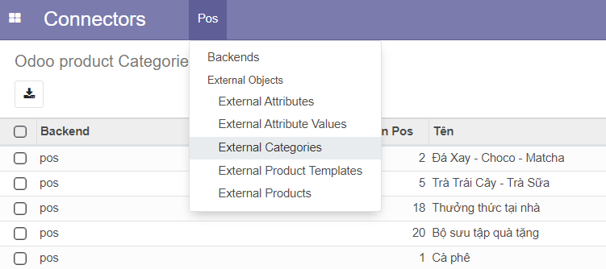

# **User Docs**

## **Connector_pos**

### Tổng quan

Khi bạn mở ứng dụng Connector_pos lần đầu tiên, một tuor hướng dẫn sẽ hiện ra từng bước giúp bạn bắt đầu.

### Các chức năng của Connector_pos
1. Tạo kết nối mới

Truy cập vào ứng dụng **Connector** chọn trình kết nối và tạo, một biểu mẫu sẽ được hiện ra để cấu hình kết nối.

Các cấu hình gồm:

- Tên kết nối (bắt buộc): đây là tên của kết nối có thể đặt tuỳ ý, nhưng hãy đặt một cách dễ nhớ.
- Company (bắt buộc): điền tên công ty (việc này sẽ tạo một công ty mới trong cơ sở dữ liệu của Odoo nếu chưa có) hoặc chọn công ty có sẵn.
- Location (bắt buộc): địa chỉ URL của web thương mại điện tử cần đồng bộ.
- Webservice key (bắt buộc): mã xác thực của web.
- Timezone: múi giờ.
- Sales team: điền tên nhóm bán hàng (việc này sẽ tạo một nhóm bán hàng mới trong cơ sở dữ liệu của Odoo nếu chưa có) hoặc chọn có sẵn.
- Importable sale order states: chỉ đồng bộ các đơn hàng có trạng thái mà người dùng muốn.
- Warehouse (bắt buộc): điền tên nhà kho (việc này sẽ tạo một nahf kho mới trong cơ sở dữ liệu của Odoo nếu chưa có) hoặc chọn có sẵn.

Sau khi hoàn thành biểu mẫu, nhấn nút **Check connection** để hoàn tất.

2. Đồng bộ

Bên dưới biểu mẫu cấu hình là các nút đồng bộ.

Người dùng nhấn nút **Import in background** để bắt đầu quá trình đồng bộ. Vào lần đầu tiên đồng bộ, nếu không có mốc thời gian cụ thể, trình kết nối sẽ đồng bộ toàn bộ dữ liệu từ trước đến nay. Người dùng có thể cài đặt một mốc thời gian cụ thể, trình đồng bộ sẽ chỉ đồng bộ tất cả các dữ liệu từ mốc thời gian đó đến hiện tại.

3. Xuất số lượng

Để chắc chắn số lượng ở cả Odoo và trang thương mại điện tử là trùng khớp, người dùng có thể điều chỉnh số lượng trên Odoo (thao tác này sẽ nói rõ hơn ở **kho hàng**), sau đó xuất về trang thương mại điện tử bằng nút **Export to Ecommerce**.

4. Lập lịch đồng bộ

Việc đồng bộ có thể được tạo tự động với hai cơ chế.

- Import refresh data: người dùng đặt một số n theo đơn vị phút để đồng bộ theo mỗi n phút các dữ liệu đơn giản (sản phẩm, khách hàng, đơn hàng, hoá đơn) rồi nhấn nút **Create and Save**. Có thể nhấn nút **Disable/Active** sau đó để tắt/bật sự đồng bộ tự động này.
- Import routine data: sử dụng tương tự Import refresh data nhưng với tính năng là đồng bộ toàn bộ dữ liệu, và sẽ đồng bộ theo mỗi n ngày.

5. Xem dữ liệu đã đồng bộ

- Xem danh mục đã đồng bộ: người dùng vào mục **External Categories** để xem các danh mục đã đồng bộ.

- Xem sản phẩm đã đồng bộ: người dùng vào mục **External Product Templates** để xem các sản phẩm đã đồng bộ.

- Xem sản phẩm theo biến thể đã đồng bộ: người dùng vào mục **External Product** để xem các sản phẩm theo biến thể.

## **Bán hàng (Sales)**

### Tổng quan

Odoo Sales là ứng dụng để chạy quy trình bán hàng của bạn (từ báo giá đến đơn đặt hàng), giao hàng và lập hóa đơn cho những gì đã bán.

### Quy trình bán hàng

1. Xem đơn hàng

Vào phần đơn hàng để xem toàn bộ các đơn hàng đã đồng bộ

2. Xuất kho và tạo hoá đơn

Vào một đơn hàng bất kỳ (đã xuất hoá đơn hoặc chưa) chọn **Giao hàng** ở góc phải trên cùng để giao hàng.

Đối với đơn hàng *chờ hoá đơn*, cần **Tạo hoá đơn** để đến giai đoạn tiếp theo.

Đơn hàng sau khi xuất kho vào tạo hoá đơn:

## **Kho hàng (Inventory)**

### Tổng quan

Odoo Inventory vừa là ứng dụng kiểm kê vừa là hệ thống quản lý kho hàng. Ứng dụng này cho phép người dùng dễ dàng quản lý thời gian giao hàng, tự động bổ sung, định cấu hình các tuyến đường nâng cao, v.v.

### Các tính năng chính

1. Xem hàng trong kho

Vào mục **Sản phẩm** để xem kho hàng

Bấm vào một sản phẩm bất kì để xem thông tin của nó

- Tồn kho: số lượng còn lại trong kho.
- Dự báo: số lượng sau khi hoàn thành các đơn nhập/xuất kho đang có.
- Truy vết: xem lịch sử nhập/xuất kho.
- Quy tắt cung ứng: các quy tắt về xuất nhập kho (ví dụ: số lượng nhập tối đa, số lượng xuất tối thiểu,...)
- Quy tắt sắp xếp: lựa chọn kho chỉ định để lưu sản phẩm khi có một trường hợp chỉ định xảy ra.
- Đã mua: số lượng mua từ bên cung cấp.
- Đã bán: số lượng đã bán.

2. Cập nhật số lượng

Người dùng sử dụng nút **Cập nhật số lượng** để điều chỉnh số lượng hàng hoá cần thiết một các chính xác.

Để số lượng này được đồng bộ ngược lại về trang thương mại điện tử, người dùng cần quay trở lại ứng dụng **Connector**, bấm **Export** để đồng bộ ngược về trang thương mại điện tử.

3. Xác nhận phiếu xuất kho

Ngoài việc phải xác nhận xuất kho trong đơn hàng của **Sales**, người dùng có thể thay thế bằng việc xuất kho trong **Hoạt động**->**Piếu chuyển kho**.

Bấm vào phiếu cần chuyển và **Xác nhận** xuất kho tương tự như thao tác ở trên.

## **Hoá đơn (Invoicing)**

### Tổng quan

Odoo Invoicing là một ứng dụng lập hóa đơn độc lập để tạo hóa đơn, gửi cho khách hàng của bạn và quản lý các khoản thanh toán.

### Quy trình thanh toán

Các hoá đơn được tạo từ **Sales** sẽ ở trạng thái nháp và cần xác nhận.

Sau khi bấm nút **Xác nhận**, bấm nút **Ghi nhận thanh toán** để hoàn tất.

Đối với các hoá đơn có sẵn (hoá đơn được đồng bộ từ trang thương mại điẹn tử), vẫn sẽ cần xác nhận xuất kho từ Odoo để đông nhất số lượng.

## **Khách hàng**

Đây là dữ liệu chính cho hoạt động bán hàng như: theo dõi khách hàng tiềm năng, chốt cơ hội và nhận dự báo chính xác, sắp xếp các cơ hội theo quy trình và quản lý các hoạt động hàng ngày của bạn bằng các cuộc họp và hoạt động tiếp theo. Tuy nhiên, hiện tại gói Connector_pos chỉ cung cấp tính năng xem thông tin khách hàng.

